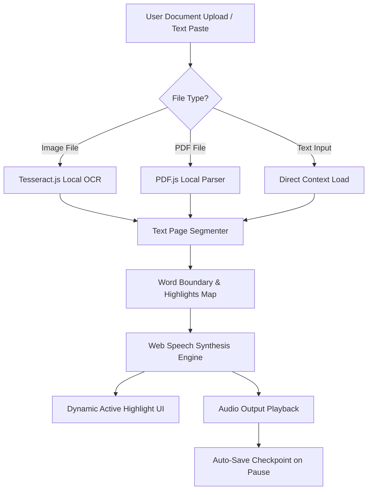

# Readora

<p align-items="center">
  
  
  
</p>

<p align-items="center">
  <strong>Readora transforms static documents and images into immersive, interactive audiobook experiences entirely in your browser.</strong>
</p>

<p align-items="center">
  Designed for students, professionals, and accessibility-focused users who want to absorb knowledge faster, multitask effortlessly, and maintain high comprehension levels.
</p>

---

## 🌐 Live Experience

<p align="center">
  <a href="https://readorav2.netlify.app/">
    
  </a>
</p>

---

## 🧠 The Problem & 🚀 The Solution

| 🧠 The Problem | 🚀 The Solution |
| :--- | :--- |
| **Too Slow:** Traditional reading speeds are bottlenecked by visual fatigue. | **Immersive Audio Engine:** High-fidelity speech synthesis for natural-sounding reading narration. |
| **No Multitasking:** You must keep your eyes on the screen constantly. | **Hands-Free Auditory Flow:** Listen to articles and PDFs on-the-go or during daily activities. |
| **Attention Fragmentation:** Hard to stay focused on long, dense wall-of-texts. | **Word-by-Word Tracker:** Visual ambient highlights sync dynamically with the spoken word to preserve visual focus. |
| **Privacy Concerns:** Uploading files online compromises private data. | **100% In-Browser Privacy:** Fully client-side processing. No files are ever sent to a server. |

---

## 🪄 Key Features

*   **Offline OCR (Tesseract.js)**: Extract text structures from images and photos completely client-side. Includes an interactive live percentage loading progress bar.
*   **Local PDF Parser (PDF.js)**: Seamlessly extract text content page-by-page from multi-page PDF files locally.
*   **Session Resume Checkpoints**: Never lose your position. Real-time checkpoints are auto-saved when you pause playback, allowing you to instantly resume from the exact word index.
*   **Floating Selection Tooltip**: Select any word or sentence in the reader view to summon a floating menu to instantly **⭐ Bookmark** the passage or **📝 Add a Note**.
*   **Centralized Library Library & Sidebar**: Slides out from the side to show your bookmarked items, annotations, and reading log history.
*   **Vocal Speed Controller**: Fine-tune speech speed rate (from `0.5x` up to `2.0x`) with a sleek control dial.

---

## 🏗️ System Design



---

## ⚙️ Built With

<p align-items="center">
  
  
  
  
  
</p>

---

## 📂 Architecture (Clean & Scalable)

```bash
project-root/
│
├── frontend/                 # Complete frontend React directory
│   ├── src/                  # React source files
│   │   ├── components/       # Modular UI components
│   │   │   ├── AudioControls.jsx   # Vocal speed dial & playback triggers
│   │   │   ├── Header.jsx          # Header brand, stats & library panel triggers
│   │   │   ├── HistorySidebar.jsx  # Slide-over sidebar for reading logs
│   │   │   ├── TextDisplay.jsx     # Spoken highlights, floating selections & annotations
│   │   │   └── WelcomeScreen.jsx   # Blurred glassmorphism landing screen
│   │   │
│   │   ├── hooks/            # Custom logic hooks
│   │   │   └── useGoalsAchievements.js  # Reading gamification rules
│   │   │
│   │   ├── utils/            # IndexDB, OCR, and parser utilities
│   │   │   └── libraryDb.js  # Offline document storage
│   │   │
│   │   ├── App.jsx           # Parent state coordinator & context provider
│   │   └── main.jsx          # DOM mounting core
```

---

## 🚀 Local Installation & Setup

Get the environment running on your computer in minutes:

1.  **Clone or Open the Repository** and open a terminal.
2.  **Enter the project directory**:
    ```bash
    cd frontend
    ```
3.  **Install dependencies**:
    ```bash
    npm install
    ```
4.  **Launch the local dev server**:
    ```bash
    npm run dev
    ```
    *   Navigate to `http://localhost:5173` to interact with the application locally!

---

## 🧭 Product Roadmap

- [x] **Phase 1 — Foundation** (Multi-format local upload, Web Speech engine, and real-time word highlighters).
- [x] **Phase 2 — Interaction** (Selection-based floating tooltips, local bookmarking, annotations system, and auto-save resume checkpoints).
- [x] **Phase 3 — Customization** (Custom fonts, custom page dimensions, and library export settings).
- [ ] **Phase 4 — Cloud Sync** (Secure cross-device data continuity and cloud-backed libraries).

---

## 👨‍💻 Creator

<p align-items="center">
  <strong>Abdul Hussain</strong><br/>
  <em>Frontend Developer • AI Systems Builder • Product Thinker</em>
</p>

---

## 💡 Product Philosophy

> **Simple. Fast. Invisible complexity.**
> Readora is built to turn technology into an invisible background layer, making the absorption of complex documents and books feel entirely effortless.
